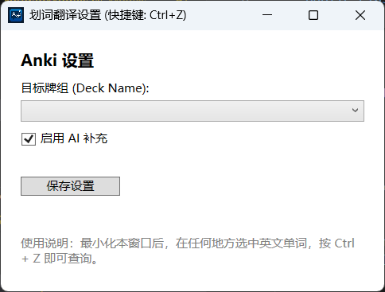

---

# WordPopupApp - 划词翻译 Anki 助手

这是一款 Windows 平台的划词翻译工具，旨在帮助用户快速查询单词释义，并一键将其添加到 Anki 中，方便后续复习。它结合了有道词典的网络爬虫和可选的 AI (Gemini) 补充功能，为用户提供丰富、全面的单词卡片信息。

## 主要功能

*   **全局热键**：在任何地方选中单词，按下 `Ctrl + Z` 即可快速查词。
*   **内容丰富**：自动从有道词典抓取单词的音标、释义、词组和柯林斯例句。
*   **AI 增强**：可选的 AI (Gemini) 模式，用于补充或生成更丰富的单词信息，尤其在有道词典信息不全时。
*   **Anki 集成**：一键将完整的单词卡片（包含释义、例句、发音）添加到指定的 Anki 牌组中。
*   **自动模板**：首次添加时，会自动在 Anki 中创建优化好的卡片模板和笔记类型 (`WordPopUpNote`)。
*   **简洁易用**：直观的设置界面和美观的查询结果弹窗。

## 软件截图

**1. 设置主界面**
程序启动后，可在此配置 Anki 牌组并选择是否启用 AI 补充。



**2. 查词弹窗**
选中单词并按下快捷键后，会弹出此窗口显示查询结果。


**3. Anki 卡片效果**
添加到 Anki 后的卡片样式，排版清晰，支持发音。

*   **卡片正面：**
    

*   **卡片背面：**
    

## 环境要求

1.  **操作系统**: Windows 10 或更高版本。
2.  **运行环境**: .NET Framework 或 .NET Core/5/6+ (根据项目编译目标决定)。
3.  **Anki**:
    *   已安装 Anki 桌面版。
    *   已在 Anki 中安装并启用 [AnkiConnect](https://ankiweb.net/shared/info/2055492159) 插件。
4.  **AI 功能 (可选)**:
    *   Python 3.8+ 环境。
    *   一个有效的 Google AI API Key (用于 Gemini 模型)。

## 安装与使用

### 步骤一：配置 Anki
1.  启动你的 Anki 桌面程序。
2.  确保 AnkiConnect 插件已经安装并启用。程序需要通过它来与 Anki 通信。

### 步骤二：配置 AI 后端 (可选)
如果您想使用 AI 补充功能，请按照以下步骤启动本地服务器：

1.  **进入 `ai` 目录**:
    ```bash
    cd ai
    ```
2.  **安装 Python 依赖**:
    ```bash
    pip install -r requirements.txt
    ```
3.  **配置 API Key**:
    *   用代码编辑器打开 `ai/server.py` 文件。
    *   找到以下代码行：
        ```python
        LLM = ChatGoogleGenerativeAI(
            model="gemini-2.0-flash",
            google_api_key= "请在这里输入你的AI ApiKey" ,  # os.getenv("GOOGLE_API_KEY"),
            temperature=0.4,
        )
        ```
    *   将 `"请在这里输入你的AI ApiKey"` 替换为您自己的 Google AI API Key。
4.  **启动本地服务**:
    ```bash
    uvicorn server:app --host 127.0.0.1 --port 8040
    ```
    请保持此命令行窗口在后台运行。

### 步骤三：运行主程序

1.  通过 Visual Studio 编译并运行项目，或者直接执行已生成的 `.exe` 文件。
2.  程序启动后，会显示设置界面 (`MainWindow.xaml`)。
3.  下拉列表会自动加载你 Anki 中的所有牌组，请选择一个用于存放单词卡片的目标牌组。
4.  如果你已经启动了 AI 后端服务，可以勾选“启用 AI 补充”。
5.  点击 **“保存设置”** 按钮。
6.  最小化设置窗口，程序会驻留在后台，并监听全局热键。

### 步骤四：开始使用

1.  在任何应用程序（如浏览器、PDF 阅读器、文档编辑器等）中，用鼠标选中一个英文单词或短语。
2.  按下快捷键 `Ctrl + Z`。
3.  鼠标指针旁边会立刻弹出查询结果窗口。
4.  如果需要将该单词存入 Anki，点击弹窗右下角的 **"+ Anki"** 按钮即可。

## 技术栈

*   **前端**: C#, WPF (.NET)
*   **核心库**:
    *   `AngleSharp`: 用于解析 HTML，抓取有道词典网页内容。
    *   `Newtonsoft.Json`: 用于处理 JSON 数据。
    *   `CommunityToolkit.Mvvm`: 实现 MVVM 设计模式。
*   **AI 后端**:
    *   Python
    *   `FastAPI`: 构建本地 API 服务。
    *   `LangChain`, `langchain-google-genai`: 调用和封装大语言模型 (Gemini)。
*   **通信**:
    *   `HttpClient`: 用于 C# 程序与网页、本地 AI 服务以及 AnkiConnect 的通信。